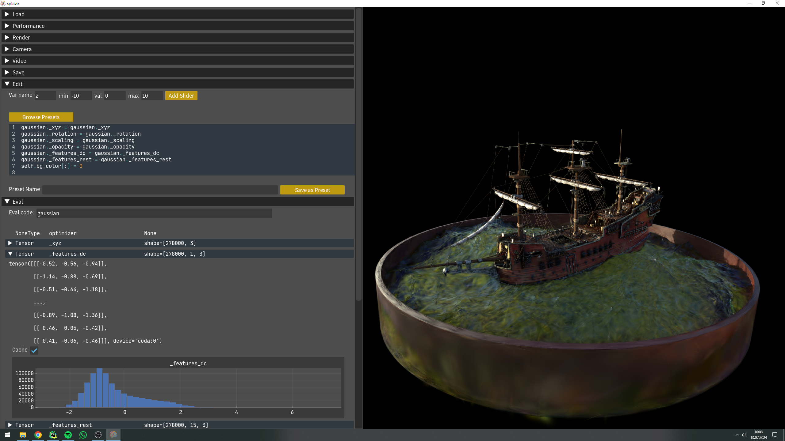
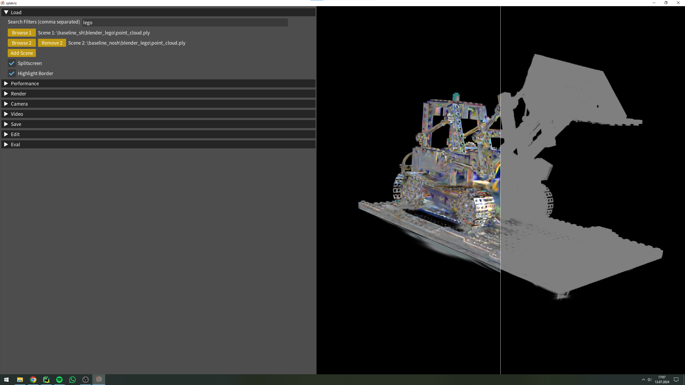
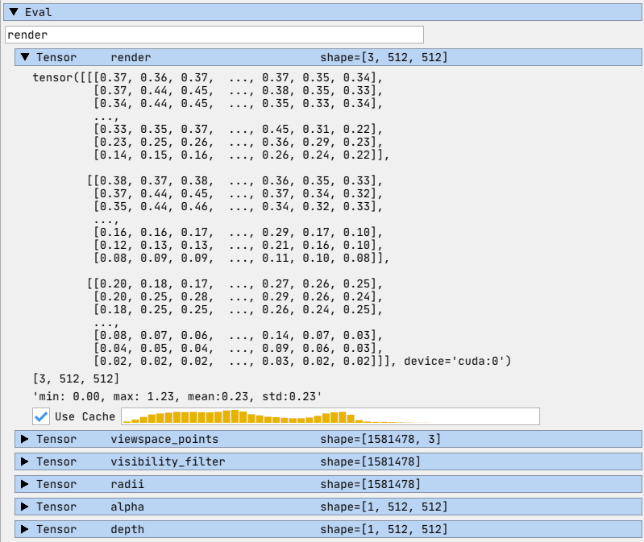
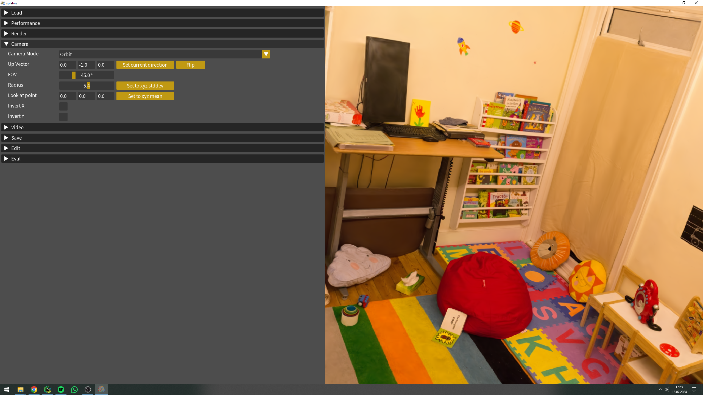
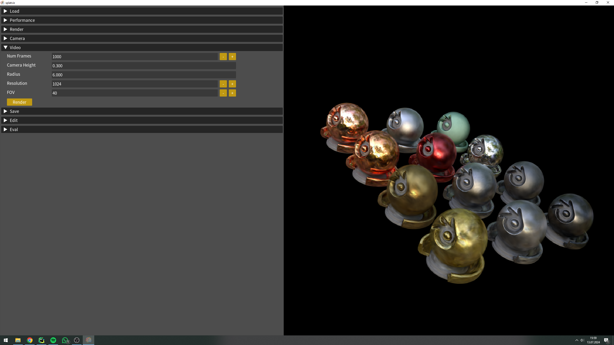
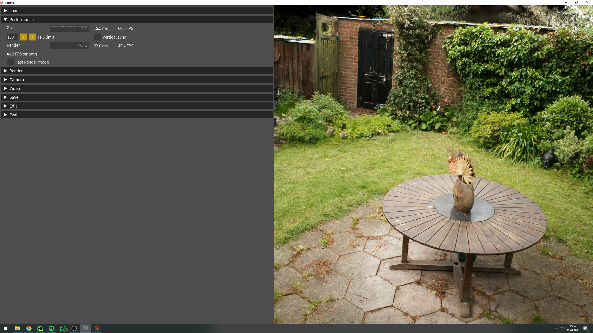
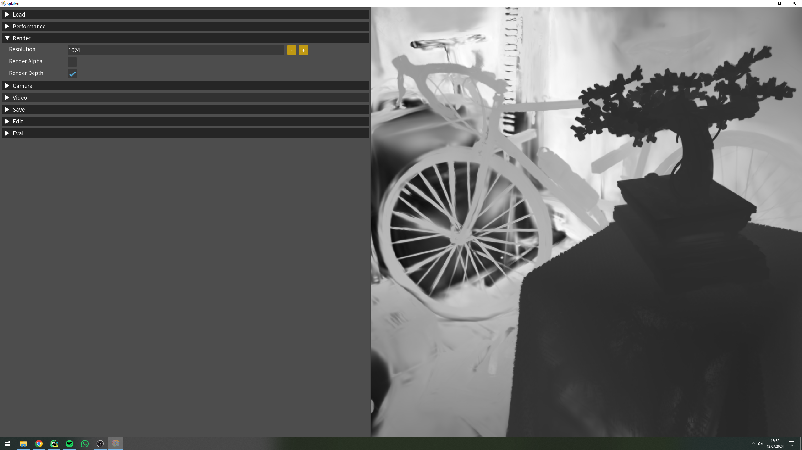

<div align="center">

  <h1> splatviz</h1>

    

</div>

<div align="justify"> 
This interactive viewer allows you to display and edit 3D Gaussian Splatting scenes in real time. By using the python GUI 
library (<a href="https://pyimgui.readthedocs.io/en/latest/guide/first-steps.html">pyimgui</a>) we can directly manipulate
the Gaussian python object just before rendering it. This enables endless editing and visualization possibilities. 
You can also evaluate python expressions just after the 
rendering, allowing you to access and debug the 3D scene just in time. Additionally, you can visualize multiple scenes
at the same time by comparing them side by side or in a splitscreen view. Lastly, you can also save renderings, ply files
of the current scene and even videos of a 360° rotation around the scene.

See some example editings in this  <a href="https://www.youtube.com/watch?v=AJGSa_wnZS8&ab_channel=FlorianBarthel">
video</a>.
</div>
<div align="center">
  
</div>

## Install
<table>
<tr>
<th>
1. Download
</th>
<td colspan="2">
Clone repository recursively in order to install glm from the diff_gaussian_rasterization package.

```bash
git clone https://github.com/Florian-Barthel/splatviz.git --recursive
```
</td>
</tr>

<tr></tr>

<tr>
<th>
2. Install
</th>
<td>
Create conda environment with <b>conda</b>:

```bash
conda env create \
-f environment.yml

conda activate gs-view
```
</td>
<td>
Alternatively, create the environment with <b>micromamba</b>:

```bash
micromamba env create \
--file environment.yml \
--channel-priority flexible -y

micromamba activate gs-view
```
</td>
</tr>
</table>


## Launch

<table>
<tr>
<th>Mode</th><th>Description</th><th>Command</th>
</tr>

<tr></tr>

<tr>
<td>Default Mode</td>
<td>The default mode loads and renders standard 3DGS scenes stored in ply files or compressed yml files.</td>
<td>

```bash
python run_main.py
```

or launch with a specified path to look for .ply or .yml files:

```bash
python run_main.py --data_path=path/with/ply/files
```
</td>
</tr>

<tr></tr>

<tr>
<td>Attach to Training</td>
<td>The _attach_ mode allows you to view and edit a running 3DGS training. This works with the default implementation of
3DGS.
In order to edit the scene during the training and to view some extra information, follow the simple steps
described <a href="splatviz_network/README.md">here</a>.</td>
<td>

```bash
python run_main.py --mode=attach
```
</td>
</tr>

<tr></tr>

<tr>
<td>Decoder Mode</td>
<td>The decoder mode renders human heads generated by 3D GANs from
this <a href="https://github.com/fraunhoferhhi/gaussian_gan_decoder/blob/main/README.md">paper</a>.</td>
<td>

```bash
python run_main.py \
--mode=decoder \
--data_path=path/with/pkl/files \
--ggd_path=path/to/gaussian_gan_decoder/project
```
</td>
</tr>
</table>

## Widgets

<div align="justify"> 

<details close>

<summary><h3>🗃️ Load Widget</h3></summary>

Once you run the `run_main.py` file, the viewer will directly load the first scene that is found in the data
directory you have specified. You can change the scene by clicking the **Browse** button. You will be displayed a list
of available _.ply_ files (or _.yml_ files that correspond to compressed gaussian scenes using
<a href="https://fraunhoferhhi.github.io/Self-Organizing-Gaussians/">this</a> compression method). If you have a lot of
scenes to chose from, you can also use the **Filter** textfield providing comma separated keywords (eg.
_lego,30000,baseline_).
You will then only see those scenes that contain all keywords.

Additionally, you can also view multiple 3D scenes at once. Simply click **Add Scene**, which loads the same scene as
before and then change the respective scene to another .ply file using the new browse button. The scenes are either
rendered next to each other or in a split screen mode when activating the **Splitscreen** checkbox.

You can download some example
scenes [here](https://drive.google.com/drive/folders/1RNMis5ibSrl2a87ZX614ZPsHKaY6ams6?usp=sharing).
They were created using the gaussian splatting compression method
from: https://fraunhoferhhi.github.io/Self-Organizing-Gaussians.


</details>


<details close>

<summary><h3>🛠️ Edit Widget</h3></summary>

The edit widget is the core functionality of this 3D viewer. It allows for real time editing of the gaussian
python object during runtime. The code that you type in this text area will be executed just before the gaussian object
is
forwarded to the cuda renderer. This means, the editing capabilities are unlimited. As long as the provided code
is executable, you can type any kind of python code and also import new libraries. An example could look like this,
where
all scales are set to -8 (before activating with _exp()_) and all opacity values are set to 10 (before activating with
_sigmoid()_), while also the background is set to 1, which corresponds to white.

```python
gaussian._scaling = gaussian._scaling * 0 - 8
gaussian._opacity = gaussian._opacity * 0 + 10
self.bg_color[:] = 1
```

To enable smooth editing transitions, you can create sliders (press **Add Slider**) which you can access in the
editor text by typing slider.name (eg. slider.x). An example could look as follows. Here, we create a boolean mask
that filters all gaussians that are smaller than the value stored in **slider.x**.

```python
mask = torch.linalg.norm(gaussian._scaling, dim=-1) < slider.x

gaussian._xyz = gaussian._xyz[mask]
gaussian._rotation = gaussian._rotation[mask]
gaussian._scaling = gaussian._scaling[mask]
gaussian._opacity = gaussian._opacity[mask]
gaussian._features_dc = gaussian._features_dc[mask]
gaussian._features_rest = gaussian._features_rest[mask]
```

Lastly, you can save and load presets of code snippets so that you don't have to type the same code again after
closing the application. Those presets are stored in a .json file (presets.json).


</details>

<details close>
<summary><h3>🔍 Eval Widget</h3></summary>

The evaluate widget can be used to debug the gaussian splatting object. By typing
python code, which is executed after the rendering, you can access any variable
from the rendering context and visualize them in a histogram. Some useful variables might be:

- gaussian
- render</li>
- render_cam
- self

You can also access variables that you have defined in the editor of the Edit Widget.


</details>


<details close>
<summary><h3>🎥 Camera Widget</h3></summary>

In the camera widget you can define the type and parameters of the camera. Most importantly, you can choose between the
two modes **Orbit** and **WASD**.

In **Orbit** mode, the camera is looking at a specific point in 3D space, and you control the pitch and yaw of the
camera
rotating on a sphere around that point by dragging with the mouse over the rendered view.

In **WASD** mode, you fly through the scene using the mouse and the WASD keys similar to the camera controls in Unity.

**Important**: If the loaded scene is rotated incorrectly, you can adjust that by steering the camera so that it is
looking straight up or down. Then set the up-vector to the current viewing direction by pressing **Set Current Direction
**.
If you were looking down, you will have to press the **Flip** button, since the scene is now upside down.


</details>


<details close>
<summary><h3>🎞️ Video Widget</h3></summary>

The video widget creates a video sequence of a full rotation around the current object.
Simply define the height of the camera and the rendering resolution. While the video is
rendering, the UI is frozen. A loading screen is shown in the terminal output.

🚧This feature is still under construction 🚧. Currently, it is not very intuitive to generate videos, as the camera
position is only defined by the <b>Camera Height</b> parameter. This will be changed in the future.


</details>


<details close>
<summary><h3>📈 Performance Widget</h3></summary>
In the performance widget, you can track the FPS of the viewer and the FPS of the renderer. You can also specify 
limits for FPS and enable vertical synchronisation. In the future, there will also be a performance mode which 
skips some editing and evaluation calculations.


</details>


<details close>
<summary><h3>🖥️ Render Widget</h3></summary>

In the render tab, you can specify the rendering resolution (at the moment only squared resolutions) and the rendering
mode.
Next to RGB, you can also render the image 3D depth and the alpha values.


</details>


<details close>
<summary><h3>💾 Save Widget</h3></summary>

To save the .ply file or a rendering of the current (edited) 3D scene press the respective button in the
save widget. Those files will be saved under _screenshots or _ply_files. The viewer might be frozen for a short
while, after saving a ply file.


</details>
</div>

## ⭐ Recent Features

**_Version 1.1.0_**

- 2024-08-12: Added a new Training Widget to inspect live training stats and to pause training
- 2024-08-11: Attach to a running 3DGS training
- 2024-08-10: Refactor rendering class for easier addition of new renderer
- 2024-08-07: Better Mouse Control (translate with middle mouse button)
- 2024-08-05: Allow editing of existing sliders
- 2024-07-30: Store slider values in presets
- 2024-07-28: New Performance Widget
- 2024-07-28: Editor now highlights special variables (gs, self, slider) and gives tooltips

**_Version 1.0.0_**

- 2024-07-12: Rebuild the whole application with imgui_bundle
- 2024-07-05: Compare two or more Gaussian Splatting scenes side by side

## 🔭 Future Plans

- Test other 3DGS render for OSX support
- Improve the Video Widget
- Tutorial for coding new widgets or renderer

## Contribute

You are more than welcome to add further functionality or a better design to this interactive viewer!
The main goal is to create an easy-to-use tool that can be applied for debugging and for understanding
3D Gaussian Splatting objects.
For reformating code please use [black](https://github.com/psf/black) with --line-length 120.

## Citation

If you find this viewer useful, please consider citing our work:

```
@misc{barthel2024gaussian,
    title={Gaussian Splatting Decoder for 3D-aware Generative Adversarial Networks}, 
    author={Florian Barthel and Arian Beckmann and Wieland Morgenstern and Anna Hilsmann and Peter Eisert},
    year={2024},
    eprint={2404.10625},
    archivePrefix={arXiv},
    primaryClass={cs.CV}
}
```

## References

This viewer is inspired by the visualizer from Efficient Geometry-aware 3D Generative Adversarial
Networks (EG3D).

- GUI: <a href="https://pyimgui.readthedocs.io/en/latest/guide/first-steps.html">pyimgui</a> and
<a href="https://github.com/pthom/imgui_bundle">imgui_bundle</a> which are python wrappers for the c++ library
<a href="https://github.com/ocornut/imgui">ImGUI</a>
- Original code base: <a href="https://github.com/NVlabs/eg3d">EG3D</a>
- 3DGS: <a href="https://repo-sam.inria.fr/fungraph/3d-gaussian-splatting/"> 3D Gaussian Splatting</a>
- Compressing 3DGS scenes: <a href="https://fraunhoferhhi.github.io/Self-Organizing-Gaussians/">Compact 3D Scene
Representation via Self-Organizing Gaussian Grids</a>
- 3DGS Rasterizer with depth and alpha: <a href="https://github.com/slothfulxtx/diff-gaussian-rasterization">Diff
rasterizer with depth and alpha</a>
