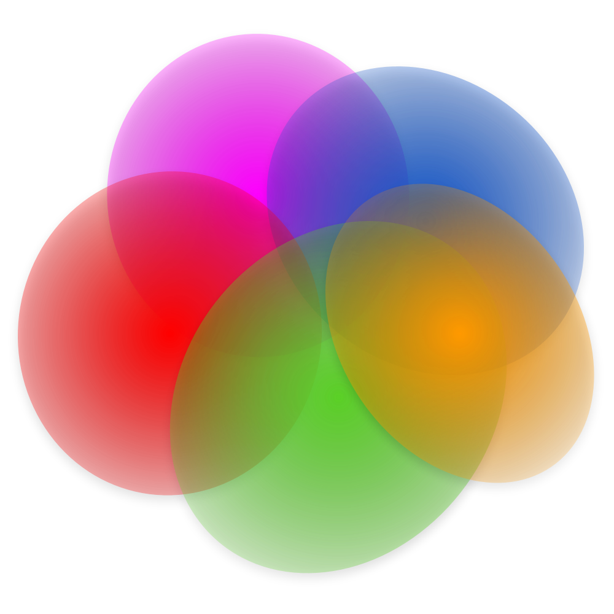
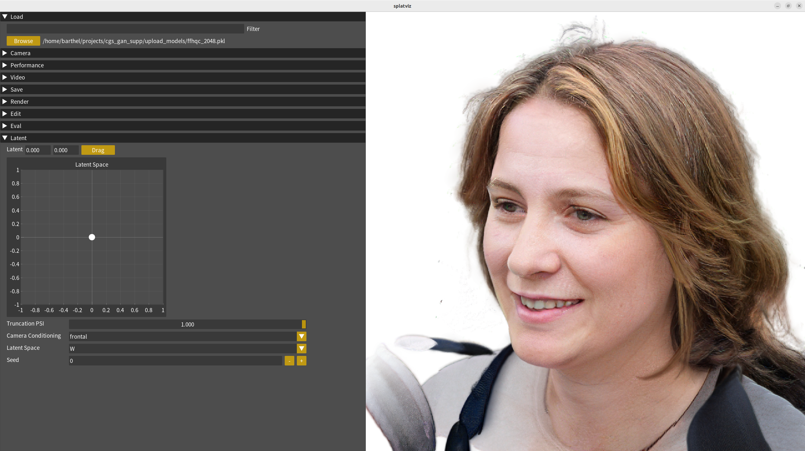
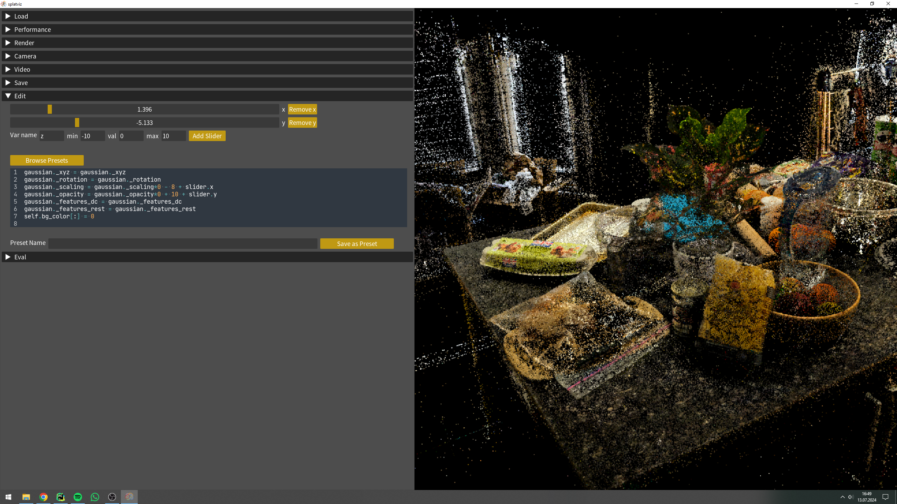

<div align="center">

  <h1> splatviz</h1>

    

</div>

<div align="justify"> 

This interactive viewer allows you to display and edit 3D Gaussian Splatting scenes in real time. By using the python GUI 
library (<a href="https://pyimgui.readthedocs.io/en/latest/guide/first-steps.html">pyimgui</a>) we can directly manipulate
the Gaussian python object **just before rendering**. This enables endless editing and visualization possibilities. 

Additionally, you can visualize multiple scenes
at the same time by **comparing them side by side** or in a splitscreen view or evaluate python expressions on the resulting scene.

See some example editings in this  <a href="https://www.youtube.com/watch?v=AJGSa_wnZS8&ab_channel=FlorianBarthel">
video</a>.

**NEW UPDATE:** splatviz supports rendering the output of 3D GANs and allows for exploring the latent space.

</div>


## Install

### 1. Download

Clone repository **recursively** in order to install glm from the diff_gaussian_rasterization package.

```bash
git clone https://github.com/Florian-Barthel/splatviz.git --recursive
```


### 2. Install

Create environment with <b>conda</b>:

```bash
conda env create -f environment.yml
conda activate gs-view
```

Alternatively, use <b>micromamba</b>:

```bash
micromamba env create --file environment.yml --channel-priority flexible -y
micromamba activate gs-view
```


## Launch

In some cases you will have to add this variable so that opengl uses the correct version:
`export MESA_GL_VERSION_OVERRIDE=3.3`

### View 3D scenes
The default mode loads and renders standard 3DGS scenes stored in ply files or compressed yml files.

```bash
python run_main.py --data_path=parent/path/with/ply/files
```

Download example scenes [here](https://drive.google.com/drive/folders/1RNMis5ibSrl2a87ZX614ZPsHKaY6ams6?usp=sharing).

### Attach to Training

Attaches to a running training (local or remote). By default the splatviz listens to the local host _127.0.0.1:6007_, which is used by 3DGS. Modify the host and port with `--host` and `--port`.
```bash
python run_main.py --mode=attach
```

To enable editing the scene during training, follow the steps
described [here](https://github.com/Florian-Barthel/splatviz_network).

### GAN Mode
The GAN mode renders 3D human heads generated by <a href="https://fraunhoferhhi.github.io/cgs-gan/">CGS-GAN</a>. First check out the cgs-gan repository: <a href="https://github.com/fraunhoferhhi/cgs-gan">https://github.com/fraunhoferhhi/cgs-gan</a> and download the network checkpoints: [ffhq_512.pkl](https://huggingface.co/anonym892312603527/neurips25/resolve/main/models/ffhq_512.pkl?download=true), [ffhq_1024.pkl](https://huggingface.co/anonym892312603527/neurips25/resolve/main/models/ffhqc_1024.pkl?download=true) or [ffhq_2048.pkl](https://huggingface.co/anonym892312603527/neurips25/resolve/main/models/ffhqc_2048.pkl?download=true). Then run the main file in gan mode:
```bash
python run_main.py --mode=gan --data_path=dir/with/network_pkl/files --gan_path=path/to/cgs-gan/project/root
```


## Widgets

<div align="justify"> 


### 🧭 Latent Widget
Running splatviz in GAN mode (using --mode=gan), allows you to render and manipulate the results of <a href="https://fraunhoferhhi.github.io/cgs-gan/">CGS-GAN</a>. Simply drag the white dot across the 2D plane to interpolate in the latent space of the GAN.
<br>


### 🗃️ Load Widget
Once you run the `run_main.py` file, the viewer will directly load the first scene that is found in the data
directory you have specified. You can change the scene by clicking the **Browse** button. You will be displayed a list
of available _.ply_ or _.yml_ files. If you have a lot of
scenes, you can also use the **Filter** textfield and provide comma separated keywords (eg. _lego,30000_).
You will then only see those scenes that contain all keywords.

Additionally, you can also view multiple 3D scenes at once. Simply click **Add Scene**, which loads the same scene as
before and then change the respective scene to another .ply file using the new browse button. The scenes are either
rendered next to each other or in a split screen mode when activating the **Splitscreen** checkbox.
<br>


### 🛠️ Edit Widget
The edit widget is the core functionality of this 3D viewer. It allows for real time editing of the gaussian
python object during runtime. The python code that you type in this text area will be executed just before rendering.
An example could look like this, where all scales are set to -8 (before activating with _exp()_) and all opacity values are set to 10 (before activating with
_sigmoid()_), while also the background is set to 1, which corresponds to white.

```python
gaussian._scaling = gaussian._scaling * 0 - 8
gaussian._opacity = gaussian._opacity * 0 + 10
```

To enable smooth editing transitions, you can create sliders (press **Add Slider**) which you can access in the
editor text by typing slider.name (eg. slider.x). An example could look as follows. Here, we create a boolean mask
that filters all gaussians that are smaller than the value stored in **slider.x**.

```python
mask = torch.linalg.norm(gaussian._scaling, dim=-1) < slider.x

gaussian._xyz = gaussian._xyz[mask]
gaussian._rotation = gaussian._rotation[mask]
gaussian._scaling = gaussian._scaling[mask]
gaussian._opacity = gaussian._opacity[mask]
gaussian._features_dc = gaussian._features_dc[mask]
gaussian._features_rest = gaussian._features_rest[mask]
```

Lastly, you can save and load presets of code snippets so that you don't have to type the same code again after
closing the application. Those presets are stored in a .json file (presets.json).
<br>


### 🔍 Eval Widget
The evaluate widget can be used to debug the gaussian splatting object. By typing
python code, which is executed after the rendering, you can access any variable
from the rendering context and visualize them in a histogram. Some useful variables might be:

- gaussian
- render</li>
- render_cam
- self

You can also access variables that you have defined in the editor of the Edit Widget.
<br>


### 🎥 Camera Widget
In the camera widget you can define the type and parameters of the camera. Most importantly, you can choose between the
two modes Orbit and WASD.
In **Orbit** mode, the camera is looking at a specific point in 3D space, and you control the pitch and yaw of the
camera rotating on a sphere around that point by dragging with the mouse over the rendered view. And in **WASD** mode, 
you fly through the scene using the mouse and the WASD keys similar to the camera controls in Unity.

**Important**: If the loaded scene is rotated incorrectly, you can adjust that by steering the camera so that it is
looking straight up or down. Then set the up-vector to the current viewing direction by pressing **Set Current Direction
**.
</div>

## ⭐ Recent Features

**_Version 1.2.0_**

- 2025-05-26: Added GAN mode.

**_Version 1.1.0_**

- 2024-08-12: Added a new Training Widget to inspect live training stats and to pause training
- 2024-08-11: Attach to a running 3DGS training
- 2024-08-10: Refactor rendering class for easier addition of new renderer
- 2024-08-07: Better Mouse Control (translate with middle mouse button)
- 2024-08-05: Allow editing of existing sliders
- 2024-07-30: Store slider values in presets
- 2024-07-28: New Performance Widget
- 2024-07-28: Editor now highlights special variables (gs, self, slider) and gives tooltips

**_Version 1.0.0_**

- 2024-07-12: Rebuild the whole application with imgui_bundle
- 2024-07-05: Compare two or more Gaussian Splatting scenes side by side

## 🔭 Future Plans

- Test other 3DGS render for OSX support
- Improve the Video Widget
- Tutorial for coding new widgets or renderer

## Contribute

You are more than welcome to add further functionality or a better design to this interactive viewer!
The main goal is to create an easy-to-use tool that can be applied for debugging and for understanding
3D Gaussian Splatting objects.
For reformating code please use [black](https://github.com/psf/black) with --line-length 120.

## Citation

If you find this viewer useful, please consider citing our work:

```
@misc{barthel2024gaussian,
    title={Gaussian Splatting Decoder for 3D-aware Generative Adversarial Networks}, 
    author={Florian Barthel and Arian Beckmann and Wieland Morgenstern and Anna Hilsmann and Peter Eisert},
    year={2024},
    eprint={2404.10625},
    archivePrefix={arXiv},
    primaryClass={cs.CV}
}
```

## References

This viewer is inspired by the visualizer from Efficient Geometry-aware 3D Generative Adversarial
Networks (EG3D).

- GUI: <a href="https://pyimgui.readthedocs.io/en/latest/guide/first-steps.html">pyimgui</a> and
<a href="https://github.com/pthom/imgui_bundle">imgui_bundle</a> which are python wrappers for the c++ library
<a href="https://github.com/ocornut/imgui">ImGUI</a>
- Original code base: <a href="https://github.com/NVlabs/eg3d">EG3D</a>
- 3DGS: <a href="https://repo-sam.inria.fr/fungraph/3d-gaussian-splatting/"> 3D Gaussian Splatting</a>
- Compressing 3DGS scenes: <a href="https://fraunhoferhhi.github.io/Self-Organizing-Gaussians/">Compact 3D Scene
Representation via Self-Organizing Gaussian Grids</a>
- 3DGS Rasterizer with depth and alpha: <a href="https://github.com/slothfulxtx/diff-gaussian-rasterization">Diff
rasterizer with depth and alpha</a>
