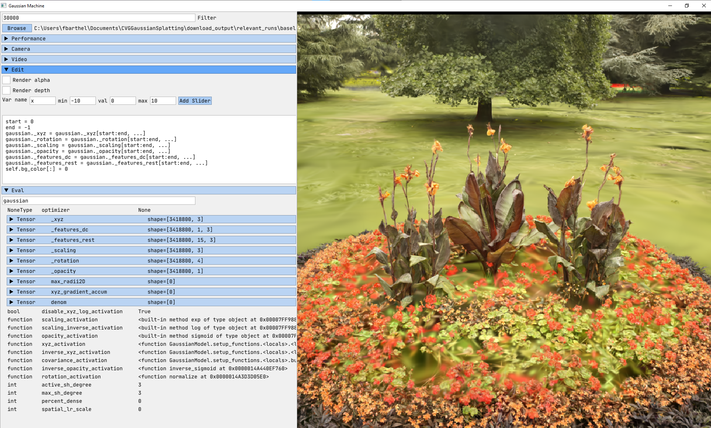
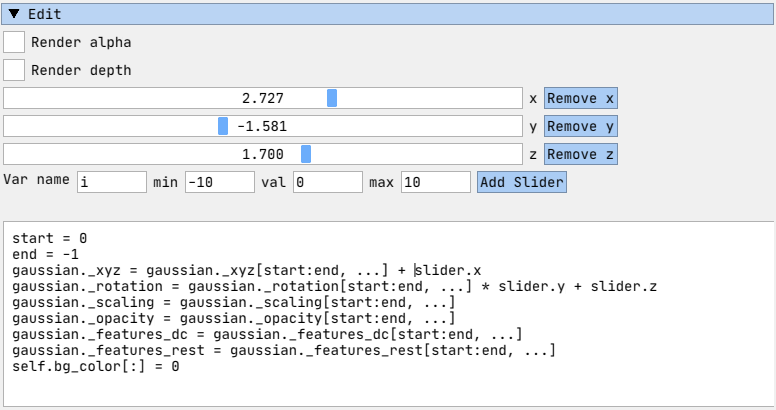

# Gaussian Viewer
This interactive viewer allows to display 3D Gaussian Splatting objects
stored as .ply files or as compressed objects from 
<a href="https://fraunhoferhhi.github.io/Self-Organizing-Gaussians/">Compact 3D Scene Representation via Self-Organizing Gaussian Grids</a>.
The viewer is fully written in python, which makes development and debugging very simple.



## Install
Clone repository **recursively** in order to install glm from the diff_gaussian_rasterization package.
```
git clone https://github.com/Florian-Barthel/gaussian_viewer --recursive
```

Create conda environment:

```
conda env create -f environment.yml
conda activate gs-view
```

Launch:

`
python main.py --data_path="path/to/directory/with/gaussian/objects"
`

## Current Features

Currently, the viewer is equipped with the following features:
- Edit Widget
- Evaluate Widget
- Video Widget

### Edit Widget
The edit widget allows to modify the Gaussian object interactively. The written code
is executed just before rendering the Gaussian object. All existing objects at that 
state can be accessed and modified. An **example** looks as follows:

````py
mask = torch.linalg.norm(gaussian._scaling, dim=1) < 10
gaussian._xyz = gaussian._xyz[mask, ...]
gaussian._rotation = gaussian._rotation[mask, ...]
gaussian._scaling = gaussian._scaling[mask, ...]
gaussian._opacity = gaussian._opacity[mask, ...]
gaussian._features_dc = gaussian._features_dc[mask, ...]
gaussian._features_rest = gaussian._features_rest[mask, ...]
````
this removes all gaussian splats with a scale greater than 10.

You can also create slider variables that can be accessed in the code block with slider.varname. **Example**:




### Evaluate Widget
The evaluate widget can be used to debug the gaussian splatting object. By typing
python code, which is executed after the rendering, you can access any variable 
from the rendering context.


### Video Widget
The video widget creates a video sequence of a full rotation around the current object.
Simply define the height of the camera and the rendering resolution. While the video is
rendering, the UI is frozen. A loading screen is shown in the terminal output.

## Contribute
You are more than welcome to add further functionality to this interactive viewer!
The main goal is to create an easy-to-use tool that can be applied for debugging and for understanding
3D Gaussian Splatting objects. Possible extensions could be to visualize the model during
the training, visualize the gradients of the gaussian positions or to simulate a densification step.

## References
This viewer is inspired by the visualizer from Efficient Geometry-aware 3D Generative Adversarial 
Networks (EG3D).

<a href="https://github.com/NVlabs/eg3d">EG3D</a>

<a href="https://repo-sam.inria.fr/fungraph/3d-gaussian-splatting/"> 3D Gaussian Splatting</a>

<a href="https://fraunhoferhhi.github.io/Self-Organizing-Gaussians/">Compact 3D Scene Representation via Self-Organizing Gaussian Grids</a>

<a href="https://github.com/slothfulxtx/diff-gaussian-rasterization">Diff rasterizer with depth and alpha</a>
