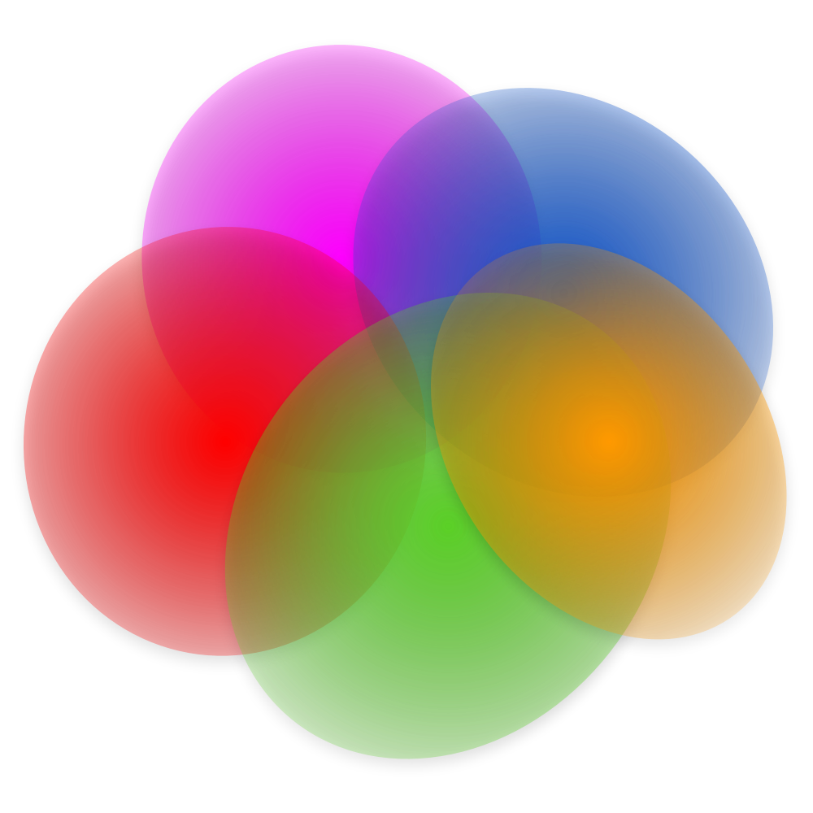
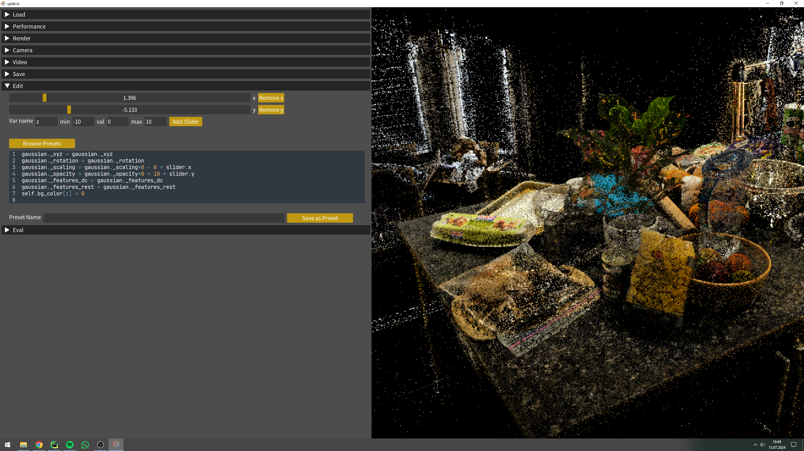
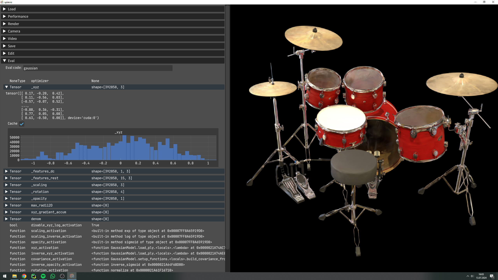

<div align="center">

  <h1>
    
    splatviz
  </h1>

  <p>
    <strong>Interactive 3D Gaussian Splatting viewer and editor.</strong>
  </p>

  <p>
    
    
    
    
    
  </p>

  <p>
    Edit splats live, compare scenes side by side, attach to training runs,
    and inspect render data with Python snippets.
  </p>

  <p>
    <a href="https://www.youtube.com/watch?v=AJGSa_wnZS8&ab_channel=FlorianBarthel">Demo video</a>
    ·
    <a href="https://drive.google.com/drive/folders/1RNMis5ibSrl2a87ZX614ZPsHKaY6ams6?usp=sharing">Example scenes</a>
    ·
    <a href="https://github.com/Florian-Barthel/ganviz">Check out ganviz</a>
  </p>

  

</div>

## Install

Install [uv](https://docs.astral.sh/uv/getting-started/installation/) with `curl -LsSf https://astral.sh/uv/install.sh | sh` and a matching CUDA Toolkit:
[11.8](https://developer.nvidia.com/cuda-11-8-0-download-archive),
[12.6](https://developer.nvidia.com/cuda-12-6-3-download-archive),
[12.8](https://developer.nvidia.com/cuda-12-8-2-download-archive), or
[13.0](https://developer.nvidia.com/cuda-13-0-3-download-archive).

```bash
git clone https://github.com/Florian-Barthel/splatviz.git
cd splatviz
```

Sync the environment with the CUDA extra for your system:

```bash
uv sync --extra cu118
uv sync --extra cu126
uv sync --extra cu128
uv sync --extra cu130
```

Then install the rasterizer:

```bash
uv pip install --no-build-isolation git+https://github.com/ashawkey/diff-gaussian-rasterization.git
```

On Windows, you may also need the 2022 Visual Studio
[C++ build tools](https://visualstudio.microsoft.com/de/visual-cpp-build-tools/).
```
winget install Microsoft.VisualStudio.2022.BuildTools
```

## Launch

```bash
python run_main.py
```

If OpenGL picks the wrong version, set:

```bash
export MESA_GL_VERSION_OVERRIDE=3.3
```

Attach to a running 3DGS training process:

```bash
python run_main.py --mode=attach
```

By default, splatviz listens on `127.0.0.1:6007`. Override with `--host` and
`--port`. For live editing during training, see
[splatviz_network](https://github.com/Florian-Barthel/splatviz_network).

## Widgets

<table>
  <tr>
    <td width="50%">
      <h3>Edit</h3>
      <p>Run Python just before rendering to modify the Gaussian object live.</p>
      
    </td>
    <td width="50%">
      <h3>Evaluate</h3>
      <p>Inspect render variables and visualize values with histograms.</p>
      
    </td>
  </tr>
</table>

## Recent Features

**Version 1.3.0**

- 2026-05: Video widget
- 2026-05: Easier install with `uv`
- 2026-05: External edit text support
- 2026-05: Resizable render window

**Version 1.2.0**

- 2025-09: Fixed eval widget and rasterizer import
- 2025-09: Simpler camera and file-browser scene loading
- 2025-09: Moved GAN mode to [ganviz](https://github.com/Florian-Barthel/ganviz)
- 2025-05: Added GAN mode

**Version 1.1.0**

- 2024-08: Training widget and live 3DGS attach mode
- 2024-08: Rendering refactor and improved mouse controls
- 2024-07: Slider presets, performance widget, and editor tooltips
- 2024-07: Multi-scene comparison

## Citation

If splatviz helps your work, please cite:

```bibtex
@misc{barthel2024gaussian,
    title={Gaussian Splatting Decoder for 3D-aware Generative Adversarial Networks},
    author={Florian Barthel and Arian Beckmann and Wieland Morgenstern and Anna Hilsmann and Peter Eisert},
    year={2024},
    eprint={2404.10625},
    archivePrefix={arXiv},
    primaryClass={cs.CV}
}
```

## References

- GUI: [pyimgui](https://pyimgui.readthedocs.io/en/latest/guide/first-steps.html), [imgui_bundle](https://github.com/pthom/imgui_bundle), and [ImGUI](https://github.com/ocornut/imgui)
- Original visualizer: [EG3D](https://github.com/NVlabs/eg3d)
- 3DGS: [3D Gaussian Splatting](https://repo-sam.inria.fr/fungraph/3d-gaussian-splatting/)
- Compression: [Self-Organizing Gaussian Grids](https://fraunhoferhhi.github.io/Self-Organizing-Gaussians/)
- Rasterizer: [diff-gaussian-rasterization](https://github.com/slothfulxtx/diff-gaussian-rasterization)
